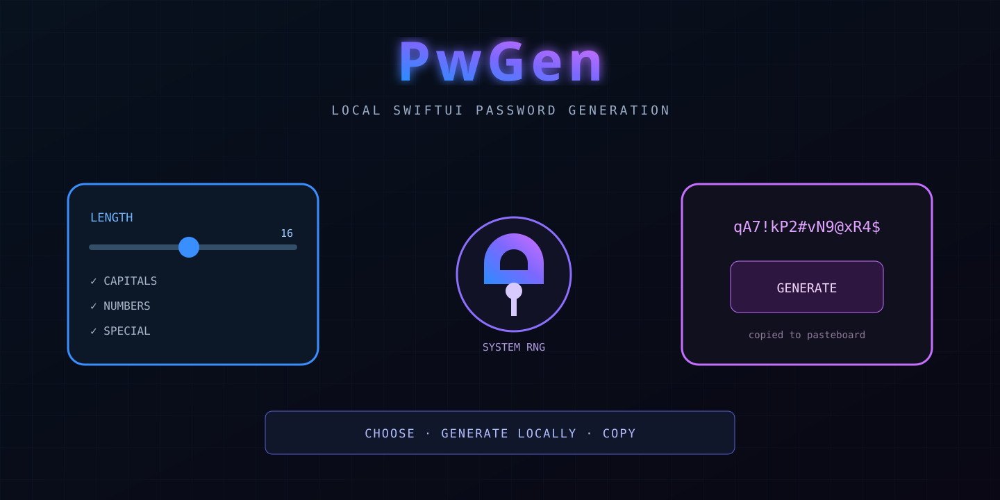
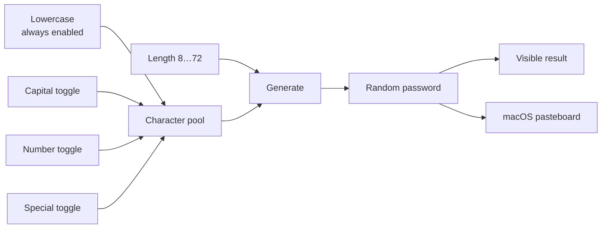
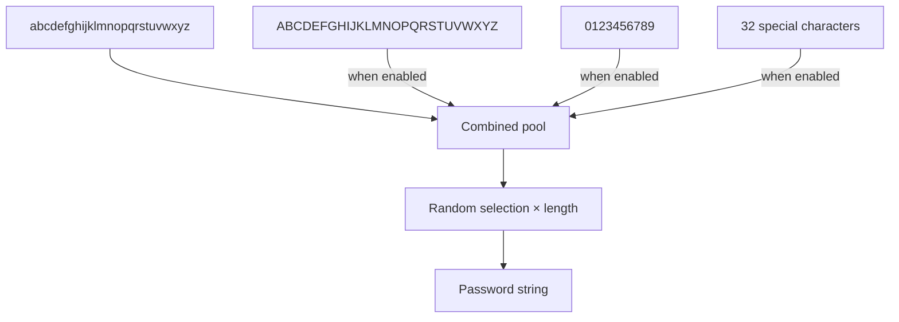
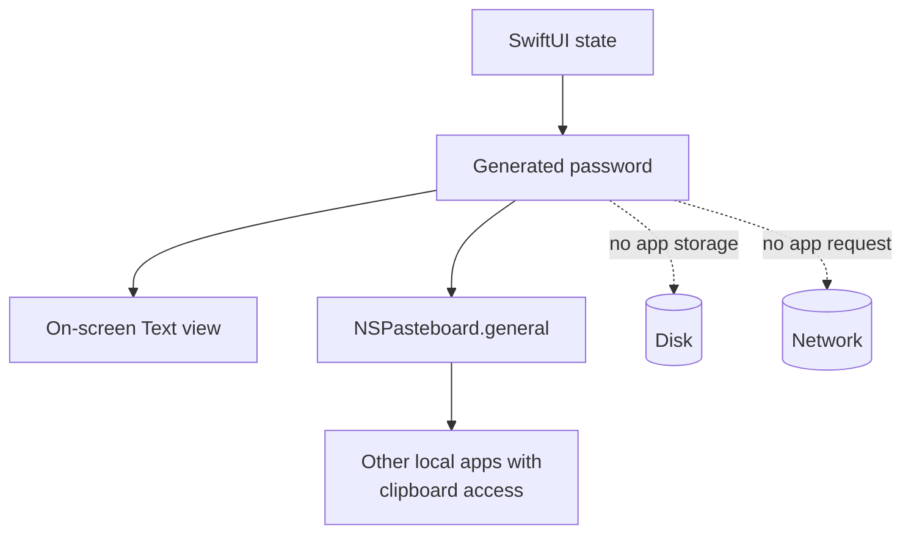
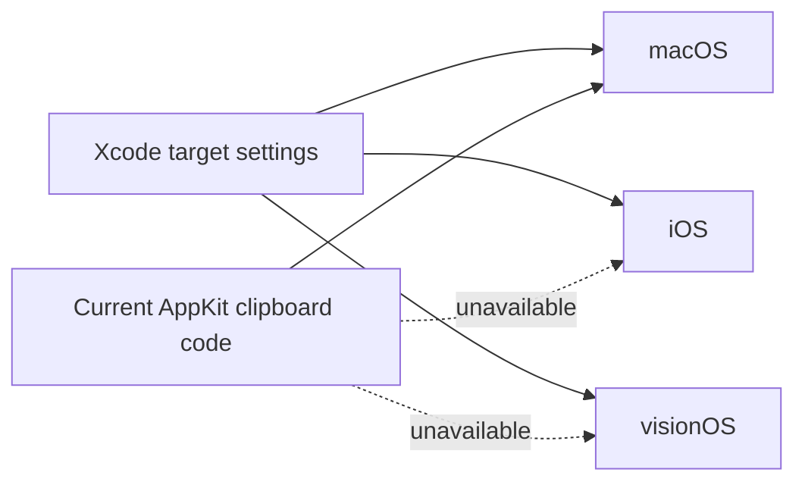
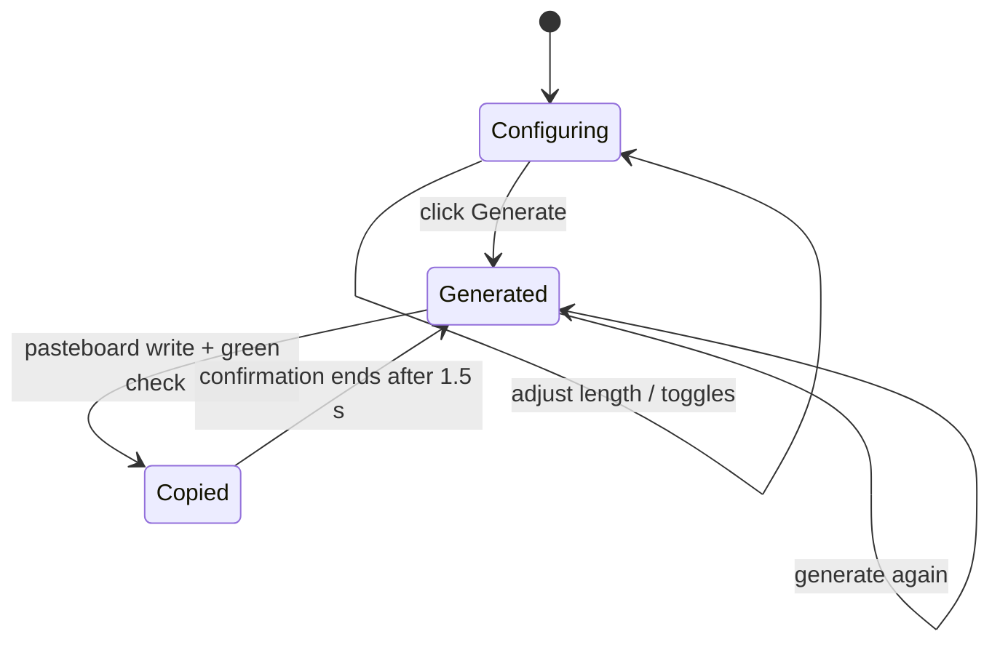

<p align="center"></p>

<h1 align="center">PwGen</h1>

<p align="center"><strong>A focused SwiftUI password generator: choose length and character classes, generate locally, copy instantly.</strong></p>

## Current application

PwGen presents a fixed-size native window with a length slider from 8 to 72 characters, three optional character-class toggles, a generate button, a monospaced result, and brief clipboard confirmation.



Lowercase letters are always included. The three switches only add capitals, digits, and symbols; there is no state in which the character pool is empty.

## Generation model

The implementation builds one combined string and calls Swift's `randomElement()` once for every requested position.



Swift's standard random APIs use the platform's default random-number generator when no generator is supplied. PwGen does not implement a custom pseudo-random algorithm, contact a server, or persist generated values.

### Important composition property

Enabling a character class makes its characters eligible; it does **not** guarantee the result contains at least one character from that class. A generated password can, by chance, omit digits, capitals, or symbols even when their switches are enabled.

For policies that require one character from every selected class, regenerate and inspect the output. The application currently performs no policy validation.

## Data boundary



The repository contains no networking code or password-storage layer. Automatic copy is still a security boundary: clipboard managers, continuity features, remote-desktop software, automation tools, and other local applications may retain or read clipboard contents.

> [!CAUTION]
> Treat the clipboard as temporary shared state. Paste promptly, then replace it with non-sensitive content. PwGen does not automatically clear the pasteboard.

## Platform truth

The Xcode project declares deployment targets for iOS 18.5+, macOS 15.5+, and visionOS 2.5+. The current source, however, imports `AppKit` and uses `NSPasteboard` unconditionally.



Therefore the checked-in implementation should be treated as **macOS-first/currently macOS-buildable**, not verified universal Apple-platform support. Real multiplatform support needs conditional imports and platform-specific clipboard adapters, followed by builds and UI tests for each target.

## Build from source

Requirements for the current implementation:

- macOS 15.5 or newer deployment target;
- Xcode 16.4 or a compatible newer Xcode;
- a signing team or local development-signing configuration as required by Xcode.

```bash
git clone https://github.com/nixfred/PwGen.git
cd PwGen
open PwGen.xcodeproj
```

Select the macOS destination, then build and run with `⌘R`.

Command-line builds can be run on a Mac with Xcode installed:

```bash
xcodebuild \
  -project PwGen.xcodeproj \
  -scheme PwGen \
  -destination 'platform=macOS' \
  build
```

## Interaction flow



Every click creates a new password and immediately overwrites the general pasteboard. There is no separate copy button, history, save, reveal/hide mode, strength score, or exclusion list.

## Testing status

The repository includes Swift Testing and XCTest targets, but their current methods are Xcode-generated templates. They do not assert:

- output length;
- membership in the configured character pool;
- distribution or entropy properties;
- clipboard behavior;
- accessibility identifiers or full UI behavior;
- builds across every declared platform.

Run the suites on macOS with:

```bash
xcodebuild \
  -project PwGen.xcodeproj \
  -scheme PwGen \
  -destination 'platform=macOS' \
  test
```

This Linux audit environment does not provide Xcode, so source and project configuration were inspected but the Apple build could not be executed here.

## Architecture

```text
.
├── PwGen/
│   ├── PwGenApp.swift          # Application entry point
│   ├── ContentView.swift       # UI, generation, and clipboard logic
│   ├── PwGen.entitlements      # App Sandbox configuration
│   └── Assets.xcassets/
├── PwGenTests/                 # Swift Testing target; template today
├── PwGenUITests/               # XCTest UI target; template today
├── PwGen.xcodeproj/            # Build settings and target definitions
├── assets/readme-hero.svg      # README title artwork
├── CONTRIBUTING.md
├── LICENSE.md                  # MIT license
└── README.md
```

The application uses direct SwiftUI state and view-local helper methods; there is no separate view model despite the previous README's “MVVM-light” label.

## Security notes

- Generated passwords exist in process memory, SwiftUI state, rendered UI, and the system pasteboard.
- App Sandbox is enabled in the entitlements file.
- The project requests user-selected read-only file access even though the current application does not expose file selection.
- No network entitlement is declared and no network API is referenced in source.
- Password quality depends on requested length, enabled pool size, and the acceptance rules of the destination service.

## License

[MIT](LICENSE.md) © 2025 PwGen.

---

<p align="center"><strong>Generate locally. Inspect the result. Respect the clipboard.</strong></p>
